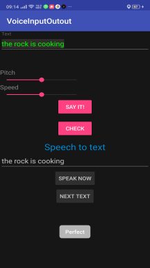

# Voice input output in android
You can input your voice and match your voice to the main text. Also, you can check the voice data (Indian English) available or not.\Speech to Text and Text to speech both technology are use in this app.\
Android Studio version 2.3.3

